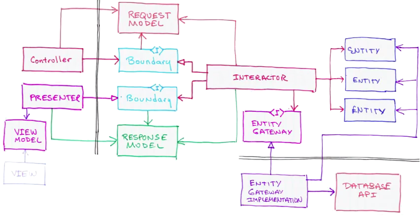

# Clean Architecture

Базовое описание дается в статье
[The Clean Architecture](https://8thlight.com/blog/uncle-bob/2012/08/13/the-clean-architecture.html).

Подробности можно узнать в этих материалах:

+ [Clean-Architecture](https://www.amazon.com/Clean-Architecture-Craftsmans-Software-Structure/dp/0134494164)
+ [Clean Code Episode 7](https://cleancoders.com/episode/clean-code-episode-7/show)


## Комментарии

Clean Architecture базируется на DIP принципе SOLID.

***

Может быть больше или меньше слоев, но Dependency Rule должно соблюдаться.

***

Понять как разделить логику между слоями Entities и Use Cases можно по следующему правилу.
Если бизнес-правило существует без автоматизации, то оно относится к слою Entities.
Если бизнес-правило содержит элементы автоматизации, вроде рассылки писем, подразумевает
наличие пользователя системы, то оно относится к слою Use Cases.

Представьте, что компьютеры еще не изобретены и вы владелец банка.
Естественно, что есть некие бизнес-процессы, например, перевод денег со счета на счет.
В помещении располагается картотека, а клерк ищет карточки клиентов,
проверяет баланс и проводит операцию перевода.
Таким образом правило перевода денег относится к Entities.

Но может быть и Use Case, использующий правила уровня Entities.
Например, текущий пользователь системы переводит деньги другому пользователю,
при этом получатель должен получить уведомление.

***

Под сценарием(use case) тут понимается один запрос к системе(backend).

Т.е. это не сценарий:
+ пользователь переходит на страницу входа в систему
+ пользователь вводит логин и пароль, нажимает на кнопку войти
+ переходит на страницу перевода денег
+ выбирает получателя
+ ...

***

Use Case не могут вызывать друг-друга.
При взгляде на код сценария мы должны видеть все его шаги.
Никто не запрещает выносить общий код в службы(service).

***



Эту диаграмму сложно понять без примера.
Вот пример на ruby:

```ruby
class Interactor
  def initialize(presenter)
    @presenter = presenter
  end

  def call(request_model)
    response_model = do_smth(request_model)
    presenter.present response_model
    nil
  end
end


presenter = Presenter.new
interactor = Interactor.new presenter
controller = Controller.new interactor
request = Request.new
controller.process request
view_model = presenter.view_model
view = View.new
view.deliver view_model
```

При таком подходе получается, что сценарий устанавливает презентеру `response_model`.
Т.е. презентер имеет состояние.

Позднее, мы
[разберем](/04-web/06-adapter)
как это соотносится с web.
